# 🎓 AI-Based Student Performance & Placement Prediction

> An AI-powered machine learning and student guidance project developed using **IBM watsonx.ai AutoAI**, **IBM Cloud**, and **IBM Bob** to predict student placement outcomes and provide personalized placement-readiness guidance.

---

## 📌 Project Overview

Student placement is an important aspect of higher education. Identifying the factors that influence placement outcomes can help students understand their placement readiness and identify areas that require improvement.

This project uses **IBM watsonx.ai AutoAI** to build, evaluate, and deploy a machine learning model for student placement prediction. The model analyzes student-related attributes such as attendance, study hours, CGPA, projects, internship experience, certifications, aptitude score, communication skills, coding skills, and mock interview performance.

The trained machine learning model was deployed as an online deployment on IBM Cloud and successfully tested using student input data.

To extend the project beyond a simple **Yes/No placement prediction**, an interactive web application named **PlacementAI** was developed using **IBM Bob**. The application integrates the IBM watsonx.ai deployment with a separate student guidance system that provides:

- Placement Readiness Score
- Student Strengths
- Areas for Improvement
- Personalized Action Plan
- Recommended Next Steps

---

## 🎯 Problem Statement

Develop an AI-powered machine learning solution that predicts whether a student is likely to be placed based on academic performance, technical skills, internship experience, certifications, aptitude scores, communication skills, coding skills, and other relevant parameters.

The project is further extended with an interactive student guidance system to help students understand their placement readiness and identify specific areas for improvement.

---

## 💡 Proposed Solution

The proposed solution combines two major components:

### 1. AI-Based Placement Prediction

- Upload and prepare the student placement dataset
- Create an IBM watsonx.ai AutoAI experiment
- Automatically generate and compare machine learning pipelines
- Select the best-performing pipeline
- Save the selected pipeline as a machine learning model
- Deploy the model as an online deployment on IBM Cloud
- Generate placement predictions using student data

### 2. PlacementAI Student Guidance System

- Collect student academic and skill-related information
- Connect with the deployed IBM watsonx.ai model
- Display the machine learning placement prediction when the IBM Cloud prediction service is available
- Calculate a rule-based Placement Readiness Score
- Identify strengths and areas for improvement
- Generate a personalized action plan
- Recommend practical next steps for placement preparation

---

## 🚀 Key Features

- AI-based student placement prediction
- Automated machine learning using IBM watsonx.ai AutoAI
- Multiple machine learning pipeline generation
- Automatic pipeline comparison and optimization
- Model evaluation
- Online model deployment
- REST API integration
- Interactive PlacementAI web application
- Student placement-readiness assessment
- Placement Readiness Score
- Strength analysis
- Areas for improvement
- Personalized action plan
- Recommended next steps
- Professional fallback during temporary IBM Cloud resource limitations

---

## 🛠️ Technologies and Services Used

### IBM Technologies

- IBM Cloud
- IBM Cloud Pak for Data
- IBM watsonx.ai AutoAI
- IBM Cloud Object Storage
- IBM Machine Learning
- IBM Deployment Space
- IBM Bob

### Web Technologies

- Node.js
- Express.js
- HTML
- CSS
- JavaScript
- REST API

### Data

- CSV Dataset

---

## 📊 Dataset Features

The dataset contains **10 input features** and **1 target column**.

| Feature | Description | Type |
|---|---|---|
| Attendance | Student attendance percentage | Input |
| Study_Hours | Average study hours | Input |
| CGPA | Academic performance | Input |
| Projects | Number of completed projects | Input |
| Internship | Internship experience | Input |
| Certifications | Number of certifications | Input |
| Aptitude_Score | Student aptitude score | Input |
| Communication_Skills | Communication skill level | Input |
| Coding_Skills | Programming skill level | Input |
| Mock_Interview_Score | Mock interview performance | Input |
| Placement | Student placement outcome | Target |

---

## 🔄 Complete System Workflow

The complete project workflow combines the IBM watsonx.ai machine learning pipeline with the PlacementAI student guidance system.

```text
Student Placement Dataset
        ↓
IBM Cloud Project
        ↓
IBM watsonx.ai AutoAI
        ↓
Data Preprocessing
        ↓
Feature Engineering
        ↓
Machine Learning Pipeline Generation
        ↓
Pipeline Comparison
        ↓
Best Model Selection
        ↓
Model Evaluation
        ↓
IBM Cloud Online Deployment
        ↓
REST API Integration
        ↓
PlacementAI Web Application
        ↓
Student Enters Academic & Skill Information
        ↓
        ┌──────────────────────────────┐
        │                              │
        ↓                              ↓
IBM AutoAI Model              Student Profile Analysis
        ↓                              ↓
Placement Prediction          Placement Readiness Score
YES / NO                      Strengths
                              Areas for Improvement
                              Personalized Action Plan
                              Recommended Next Steps
        │                              │
        └──────────────┬───────────────┘
                       ↓
          Complete Student Guidance Result
```

---

## 🧠 Machine Learning Workflow

1. Create an IBM Cloud project
2. Upload the student placement dataset
3. Create an AutoAI experiment
4. Select `Placement` as the prediction column
5. Run the AutoAI experiment
6. Generate multiple machine learning pipelines
7. Compare pipeline performance
8. Select the best-performing pipeline
9. Evaluate the selected model
10. Save the selected pipeline as a model
11. Create a deployment space
12. Deploy the model as an online deployment
13. Test the deployed model
14. Generate placement predictions
15. Integrate the deployment with the PlacementAI web application

---

## 🤖 Model Information

| Parameter | Details |
|---|---|
| Problem Type | Binary Classification |
| Prediction Column | Placement |
| Training Platform | IBM watsonx.ai AutoAI |
| Best Pipeline | Pipeline 9 |
| Algorithm | Batched Tree Ensemble Classifier (Snap Random Forest Classifier) |
| Cross-Validation Accuracy | 0.970 |
| Holdout Accuracy | 0.960 |
| Deployment Type | Online |
| Prediction Output | Yes / No |

---

## 📈 Model Results

The AutoAI experiment generated **9 machine learning pipelines** using different algorithms and optimization techniques.

The top-ranked pipeline was **Pipeline 9**, which used a **Batched Tree Ensemble Classifier (Snap Random Forest Classifier)**.

### Performance

- **Cross-validation accuracy: 97%**
- **Holdout accuracy: 96%**

The selected model was successfully saved as:

`Student Placement Predictor`

The model was deployed as an online deployment named:

`Student Placement API`

The deployed model was successfully tested and generated a placement prediction of **Yes** for the recorded test input.

---

# 📸 IBM Cloud Project Screenshots

## 1. Project Overview

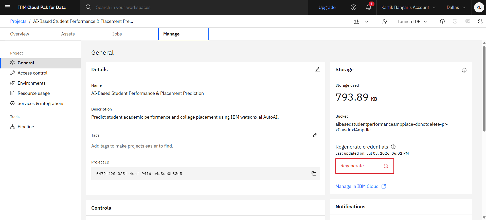

---

## 2. Project Assets

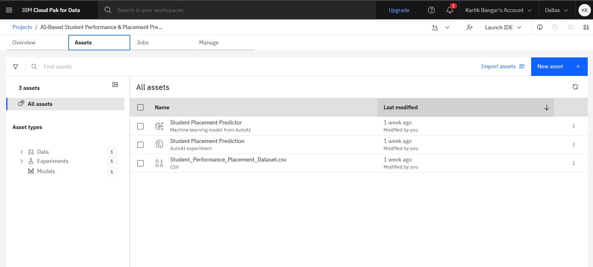

---

## 3. Dataset Preview

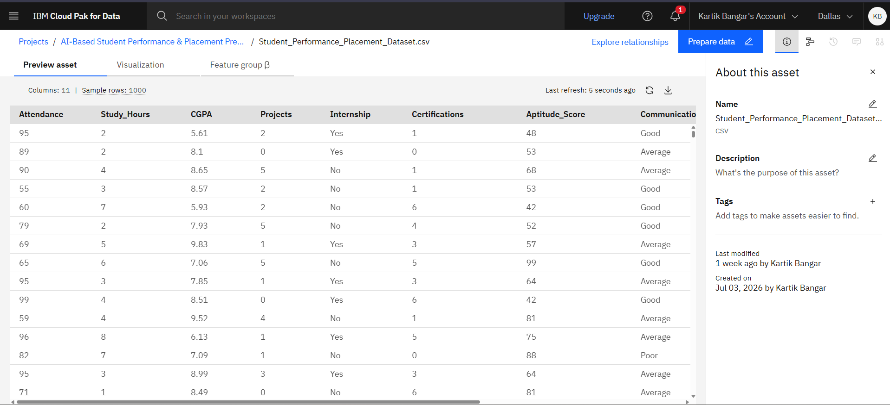

---

## 4. AutoAI Relationship Map

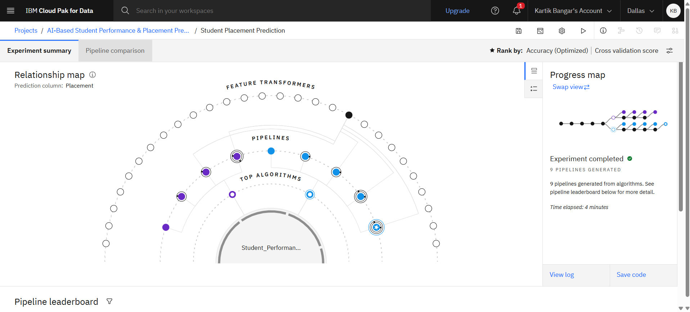

---

## 5. Pipeline Leaderboard

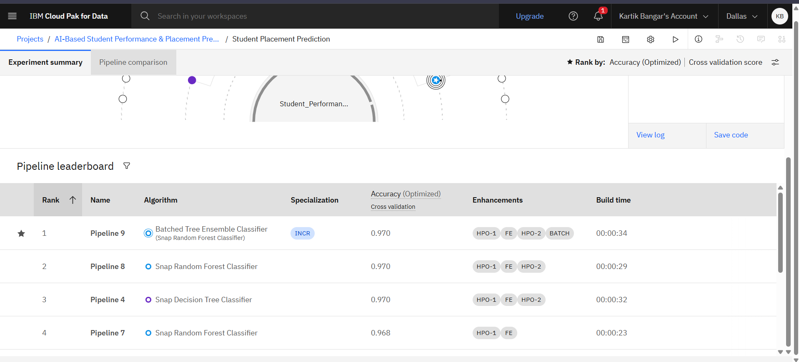

---

## 6. Model Evaluation

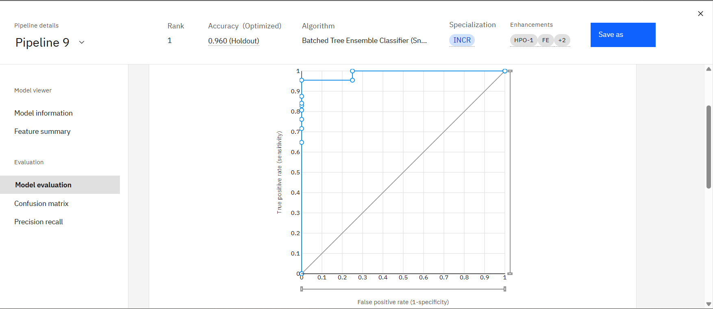

---

## 7. Deployment Space

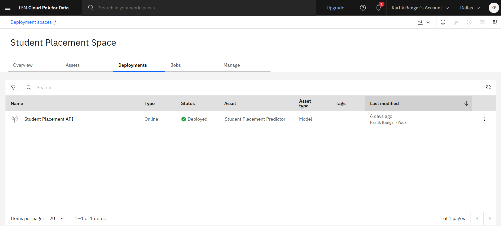

---

## 8. API Deployment

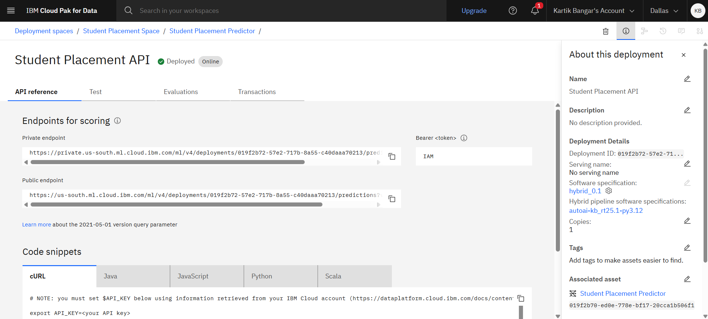

---

## 9. Prediction Result

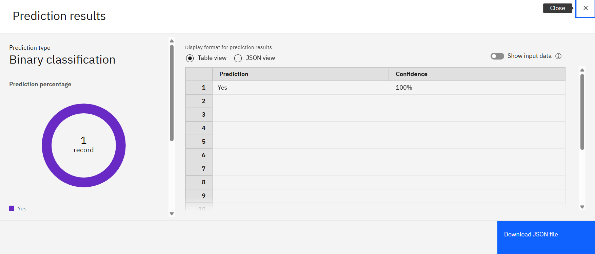

---

## 10. Deployment Dashboard

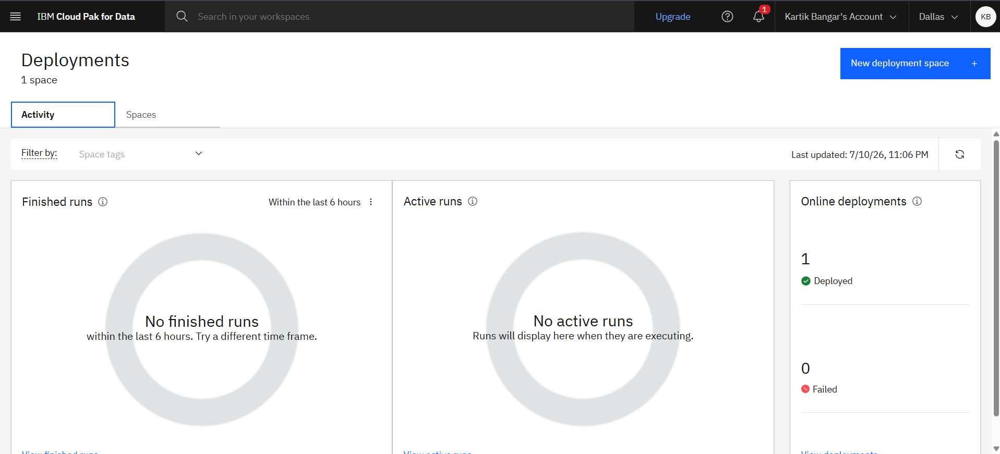

---

## ⚙️ Project Implementation

### Step 1: Create the IBM Cloud Project

A new project named **AI-Based Student Performance & Placement Prediction** was created in IBM Cloud Pak for Data.

### Step 2: Upload the Dataset

The `Student_Performance_Placement_Dataset.csv` file was uploaded to the project.

### Step 3: Create an AutoAI Experiment

An AutoAI experiment named **Student Placement Prediction** was created using the uploaded dataset, with `Placement` selected as the target prediction column.

### Step 4: Train the Model

IBM watsonx.ai AutoAI automatically processed the dataset and generated multiple machine learning pipelines.

### Step 5: Select the Best Pipeline

The generated pipelines were compared based on their performance. **Pipeline 9** was selected as the top-ranked pipeline.

### Step 6: Save the Model

The selected pipeline was saved as a machine learning model named:

`Student Placement Predictor`

### Step 7: Create the Deployment

A deployment space named:

`Student Placement Space`

was used to create an online deployment named:

`Student Placement API`

### Step 8: Test the Deployment

The deployed model was tested using student input data and successfully returned a placement prediction.

### Step 9: Develop the PlacementAI Web Application

An interactive web application named **PlacementAI** was developed using **IBM Bob**.

The application provides an interface for students to enter their academic and skill-related information.

### Step 10: Integrate IBM watsonx.ai

The web application includes backend integration with the deployed IBM watsonx.ai AutoAI model through the IBM Cloud prediction API.

The IBM AutoAI model remains responsible for the machine learning-based placement prediction.

### Step 11: Add the Student Guidance System

A separate rule-based guidance system was implemented to provide:

- Placement Readiness Score
- Student Strengths
- Areas for Improvement
- Personalized Action Plan
- Recommended Next Steps

The guidance system complements the IBM AutoAI prediction and does not generate fake machine learning predictions.

---

# 🌐 PlacementAI Web Application

**PlacementAI** extends the original placement prediction project into an interactive student placement guidance platform.

## Main Features

- Interactive student assessment form
- IBM watsonx.ai AutoAI prediction integration
- Placement Readiness Score
- Student strengths analysis
- Areas for improvement
- Personalized action plan
- Recommended next steps
- Responsive web interface
- Graceful handling of temporary IBM Cloud resource limitations

---

## 🧠 Prediction and Guidance Architecture

The system contains two separate components.

### IBM watsonx.ai AutoAI Model

- Performs the machine learning-based placement prediction
- Uses the trained and deployed AutoAI model
- Generates a `Yes` or `No` placement prediction when IBM Cloud prediction resources are available

### Placement Guidance System

- Analyzes the student's entered academic and skill information
- Calculates a rule-based Placement Readiness Score
- Identifies strengths
- Identifies areas requiring improvement
- Generates a personalized action plan
- Recommends practical next steps

> **Note:** If IBM Cloud prediction resources are temporarily unavailable due to Capacity Unit Hour (CUH) limitations, PlacementAI continues to provide its rule-based readiness analysis and personalized guidance. No fake or simulated AI prediction is generated.

---

# 🌐 PlacementAI Web Application Screenshots

## 1. PlacementAI Homepage

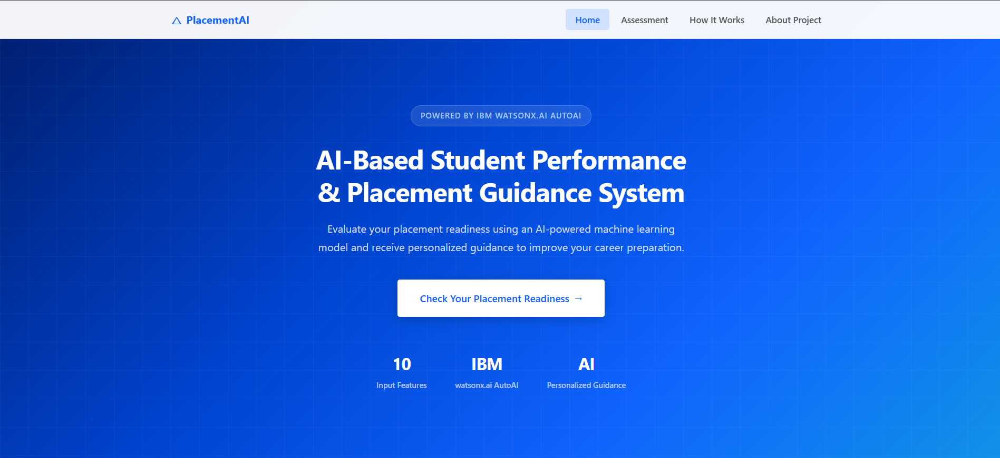

---

## 2. Student Assessment Form

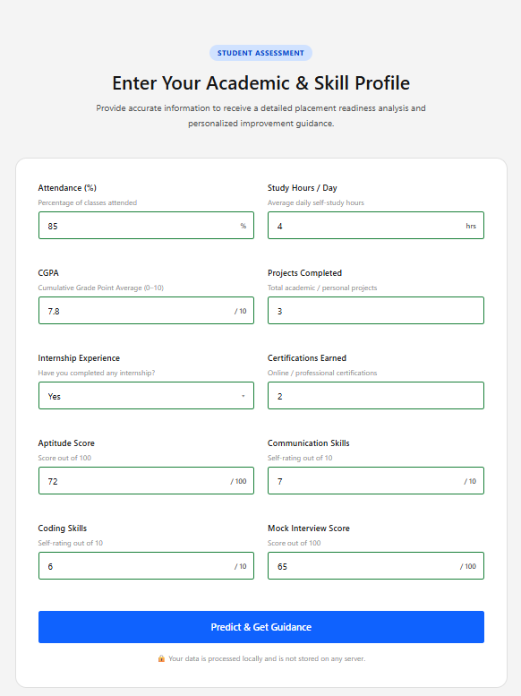

---

## 3. Placement Readiness Results

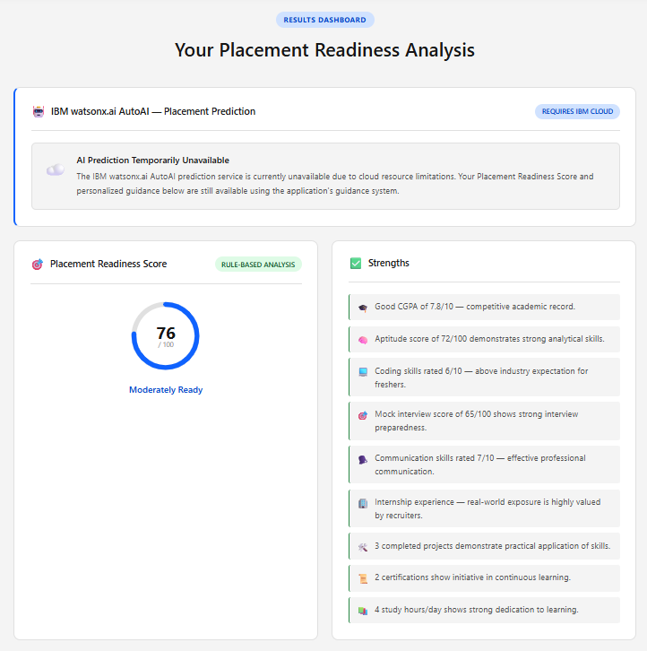

---

## 4. Personalized Guidance

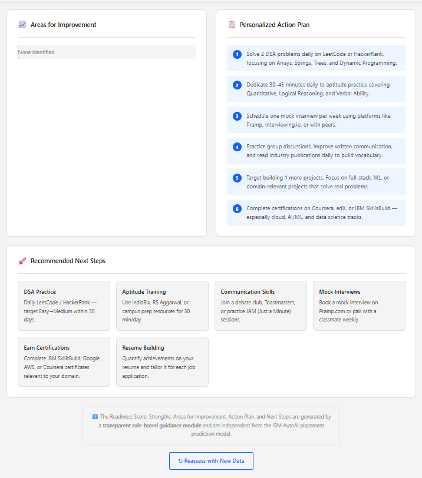

---

## 5. PlacementAI Workflow

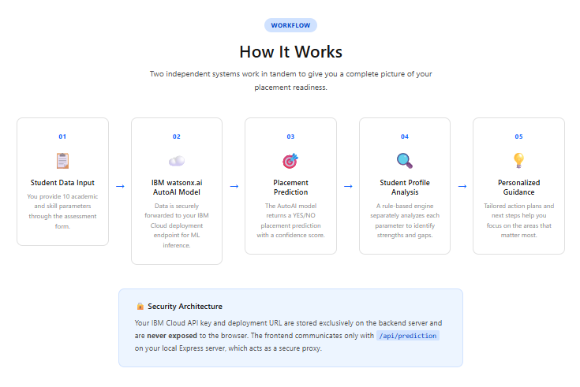

---

## 6. About Project

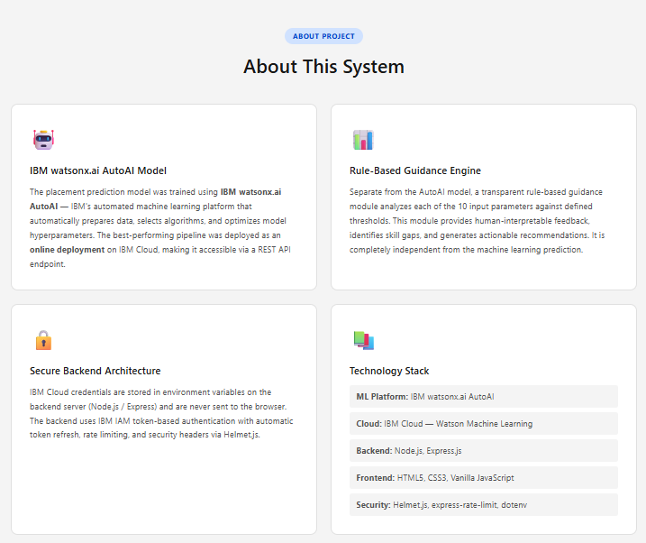

---

## 📁 Repository Structure

```text
AI-Based-Student-Performance-and-Placement-Prediction/
│
├── README.md
├── Problem_Statement.pdf
├── IBM_Project_Report.docx
├── AI-Based Student Placement Prediction.pptx
├── Student_Performance_Placement_Dataset.csv
│
├── PlacementAI-Web-Application/
│   ├── public/
│   │   ├── index.html
│   │   ├── styles.css
│   │   └── script.js
│   │
│   ├── server/
│   │   ├── server.js
│   │   └── guidanceEngine.js
│   │
│   ├── .env.example
│   ├── .gitignore
│   ├── package.json
│   └── package-lock.json
│
└── Screenshots/
    │
    ├── IBM Cloud Screenshots
    │   ├── API_Deployment.png
    │   ├── Assets_List.png
    │   ├── AutoAI_Relationship_Map.png
    │   ├── Dataset_Preview.png
    │   ├── Deployment_Dashboard.png
    │   ├── Deployment_Space.png
    │   ├── Model_Evaluation_ROC.png
    │   ├── Pipeline_Leaderboard.png
    │   ├── Prediction_Result.png
    │   └── Project_Overview.png
    │
    └── PlacementAI Screenshots
        ├── PlacementAI_Homepage.png
        ├── Student_Assessment_Form.png
        ├── Placement_Readiness_Results.png
        ├── Personalized_Guidance.png
        ├── PlacementAI_Workflow.png
        └── PlacementAI_About_Project.png
```

> All screenshot files are stored directly inside the `Screenshots` folder. The grouping above is shown only to clearly distinguish IBM Cloud screenshots from PlacementAI web application screenshots.

---

## ⚙️ How to Reproduce the Machine Learning Project

1. Log in to IBM Cloud.
2. Open IBM Cloud Pak for Data.
3. Create a new project.
4. Upload `Student_Performance_Placement_Dataset.csv`.
5. Create a new AutoAI experiment.
6. Select the uploaded dataset as the data source.
7. Select `Placement` as the prediction column.
8. Run the AutoAI experiment.
9. Compare the generated pipelines.
10. Select and save the best-performing pipeline as a model.
11. Create or select a deployment space.
12. Promote the saved model to the deployment space.
13. Create an online deployment.
14. Test the deployed model using student input data.

---

## 💻 How to Run the PlacementAI Web Application

### 1. Open the web application folder

```bash
cd PlacementAI-Web-Application
```

### 2. Install dependencies

```bash
npm install
```

### 3. Configure environment variables

Copy `.env.example` and create a new file named `.env`.

Add the required IBM Cloud configuration values to the local `.env` file.

> Never upload the `.env` file containing real IBM Cloud credentials or API keys to a public repository.

### 4. Start the application

```bash
npm start
```

### 5. Open the application

Open the local application address displayed in the terminal.

---

## 🔐 Security

- IBM Cloud API credentials are stored only in the local `.env` file.
- The `.env` file is excluded from GitHub using `.gitignore`.
- `.env.example` contains only placeholder configuration values.
- IBM Cloud credentials are not exposed in frontend code.
- No fake or hardcoded AI placement predictions are used.

---

## 🔮 Future Scope

The project can be further extended with:

- Public cloud deployment of the PlacementAI web application
- AI-powered career path recommendation
- Resume analysis
- Interview performance prediction
- Student recommendation system
- Mobile application
- Real-time institutional dashboard
- Integration with college ERP systems
- Advanced personalized recommendation models
- Deep learning integration

---

## 🎓 Applications

### For Students

- Understand placement readiness
- Identify strengths and weaknesses
- Receive personalized improvement guidance
- Follow a structured placement preparation plan
- Improve career preparation

### For Educational Institutions

- Analyze student placement readiness
- Identify students who may require additional support
- Support data-driven placement preparation
- Improve placement training strategies

---

## 👨‍💻 Developed By

**Kartik Bangar**

B.Tech – Electronics & Telecommunication Engineering  
MIT Academy of Engineering (MITAOE)

**IBM SkillsBuild AICTE Internship 2026**

---

## 📄 Project Files

This repository contains:

- Project Problem Statement
- IBM Project Report
- Project Presentation
- Student Placement Dataset
- IBM Cloud implementation screenshots
- PlacementAI web application screenshots
- PlacementAI frontend and backend source code
- IBM watsonx.ai API integration
- Student guidance system
- Complete project documentation

---

## 🙏 Acknowledgements

- IBM SkillsBuild
- IBM watsonx.ai
- IBM Cloud
- IBM Bob
- AICTE
- MIT Academy of Engineering
